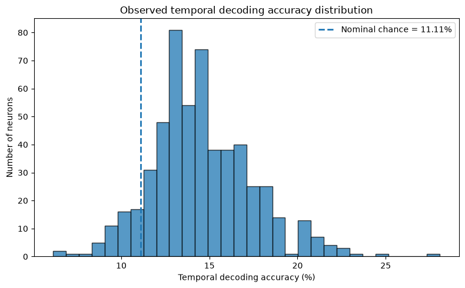
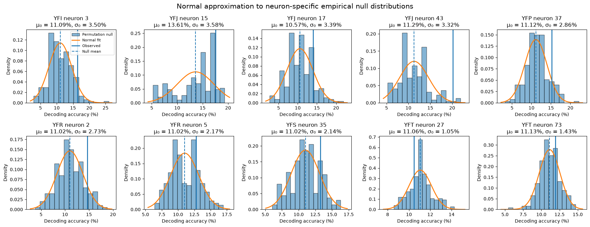
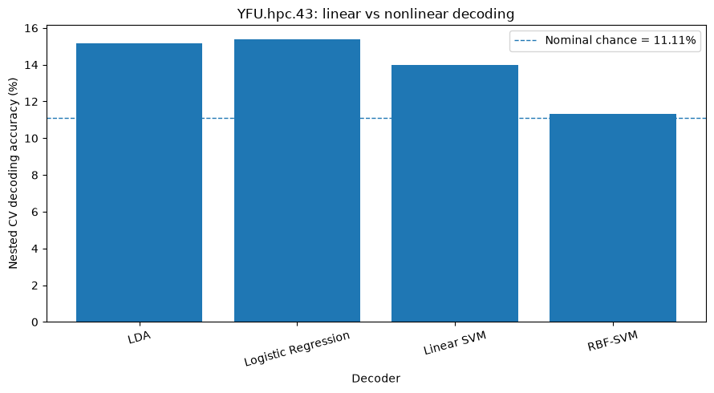
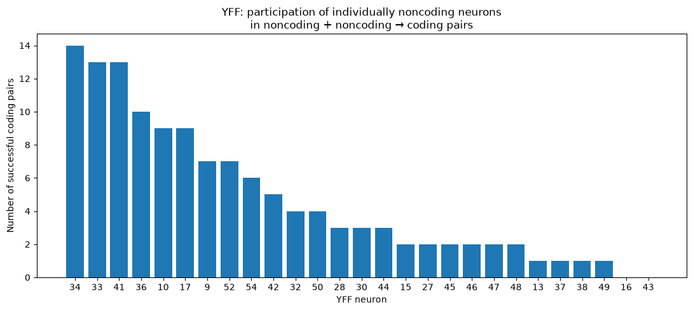

# Weekly Research Update
## Number Representation / Number-Simplex Project
###  Meeting — October 2, 2026

This week I worked in four directions:

1. **Preliminary Bayesian analysis of number coding**
2. **Comparison of alternative single-neuron classifiers**
3. **Paired-neuron decoding analysis**
4. **Beginning Figure 2 population/simplex geometry reproduction**

---

# 1. Preliminary Bayesian Analysis of Number Coding

## Motivation

The paper identifies number-coding neurons primarily using a permutation-test
criterion based on decoding accuracy.

I started exploring whether the evidence for number coding could instead be
described probabilistically using a Bayesian framework, rather than relying
only on a binary significance decision such as

$$
p < 0.05.
$$

The broader idea was to ask whether we can quantify our uncertainty about
whether a neuron belongs to a **null/non-coding population** or a
**number-informative population**.

---

$$ 
\boxed{
\begin{aligned}
\textbf{Population proportion:}\qquad
&\pi\sim\operatorname{Beta}(1,1)
\\[4pt]
\textbf{Latent coding state:}\qquad
&Z_i\mid\pi\sim\operatorname{Bernoulli}(\pi)
\\[4pt]
\textbf{Non-coding model:}\qquad
&A_i\mid Z_i=0\sim f_{0i}
&&\text{(estimated from label shuffles)}
\\[4pt]
\textbf{Coding model:}\qquad
&A_i\mid Z_i=1\sim f_1
&&\text{(signal distribution to be inferred)}
\\[4pt]
\textbf{Observed-data likelihood:}\qquad
&p(A_i\mid\pi)
=(1-\pi)f_{0i}(A_i)+\pi f_1(A_i)
\\[4pt]
\textbf{Posterior outputs:}\qquad
&P(Z_i=1\mid D)
\\
&p(\pi\mid D)
\end{aligned}
}
$$ 
T

## Initial $F_0/F_1$ Idea

I considered two possible accuracy-generating distributions:

$$
F_0 = \text{distribution of decoding accuracy under no number information}
$$

and

$$
F_1 = \text{distribution of decoding accuracy when number information is present}.
$$

Conceptually:

- $F_0$: null / non-coding neurons
- $F_1$: signal / number-coding neurons

For the 9-way number-decoding problem, chance accuracy is

$$
\frac{1}{9} \approx 0.111.
$$

The goal is eventually to estimate something like

$$
P(\text{coding} \mid \text{observed decoding accuracy})
$$

rather than simply classifying a neuron according to a permutation-test
threshold.

---

## Preliminary Model Explored

I experimented with a simple mixture formulation:

$$
A_i \sim (1-\pi)F_0 + \pi F_1,
$$

where:

- $A_i$ is the observed decoding accuracy of neuron $i$,
- $F_0$ represents the null distribution,
- $F_1$ represents the signal distribution,
- $\pi$ represents the proportion of neurons belonging to the signal population.

As an exploratory/toy implementation, I tried assumptions including

$$
A \mid Z=0 \sim N\left(\frac{1}{9}, 0.02^2\right)
$$

for the null component, together with a shifted-Beta-type distribution for
the signal component and

$$
\pi \sim \mathrm{Beta}(1,1).
$$

However, the unconstrained fit produced a very large inferred signal
proportion (approximately **98%**) and a signal mean around **14.65% accuracy**.

This result was clearly highly dependent on the assumed forms of $F_0$
and $F_1$.

Therefore, I have **not interpreted this as a biological result** and have
not extended it to all subjects.

---

## Current Status / Question 

This analysis is still preliminary.

Before developing it further, I want to ask:

> **Is an $F_0/F_1$ Bayesian mixture approach a sensible way to quantify
> evidence for number coding, or should I formulate the Bayesian question
> differently?**

In particular:

- How should the null distribution $F_0$ be constructed?
- Should $F_0$ come directly from the permutation distribution?
- How should the signal distribution $F_1$ be modeled?
- Should the target quantity be a posterior probability of coding?
- Would a Bayesian credible interval for decoding performance be more meaningful?

I have deliberately **not scaled this analysis to every neuron/subject yet**
because I first want to confirm that the statistical formulation is sensible.

---

# 2. Comparison of Different Decoders

## Motivation

The original single-neuron analysis uses **regularized Linear Discriminant
Analysis (LDA)**.

I wanted to check whether the observed temporal number information was
specific to LDA or whether similar information could be extracted using
other classifiers.

---

## Classifiers Tested

I compared several classifiers using the same general number-decoding
problem.

### Linear classifiers

1. Regularized **LDA**
2. **Multinomial Logistic Regression**
3. **Linear Support Vector Machine (SVM)**

I also tested a **nonlinear decoder** as an exploratory comparison.

---

## Main Observation

The three linear classifiers produced broadly similar decoding behavior.

There were neuron-level differences:

- Sometimes LDA performed slightly better.
- Sometimes logistic regression performed slightly better.
- Sometimes linear SVM performed slightly better.

However, I did not observe a systematic alternative linear classifier that
clearly outperformed LDA.

The nonlinear decoder I tested also did **not** produce a clear improvement
over the linear decoders.

---

## Interpretation

The classifier comparison suggests that the temporal number information is
not obviously an artifact of one particular linear classifier.

Therefore, at this point I do not see a strong reason to replace LDA for
the main reproduction.

### Question 

> **Is this classifier comparison sufficient as a robustness check, or is
> there another decoder/model comparison that would be informative?**

---

# 3. Paired-Neuron Decoding Analysis

## Motivation

For each subject, I considered all possible pairs of neurons and compared
the pair's temporal decoding performance with the decoding performance of
the individual neurons.

So far I have performed this analysis for two subjects:

- **YFF**
- **YFI**

---

# 3.1 YFF

YFF contained

$$
37 \text{ neurons}.
$$

Therefore, the number of possible neuron pairs was

$$
\binom{37}{2} = 666.
$$

### Summary

| Quantity | Result |
|---|---:|
| Number of neurons | 37 |
| Number of neuron pairs | 666 |
| Mean single-neuron temporal accuracy | 15.55% |
| Coding single neurons | 27.03% |
| Mean paired-neuron accuracy | 16.75% |
| Coding neuron pairs | 36.04% |
| Mean gain relative to best constituent neuron | -0.79 percentage points |

The average paired accuracy was somewhat higher than the average
single-neuron accuracy.

| Question | FR | Temporal | What it tells us |
|---|---:|---:|---|
| Average single-neuron accuracy | 10.19% | 15.55% | Baseline |
| Average pair accuracy | 11.42% | 16.75% | Pairs are higher on average |
| Difference in averages | **+1.23 pp** | **+1.20 pp** | Suggests a population-level benefit |
| Pair beats its **better constituent neuron** | 33.33% | 28.83% | Only a minority of pairs |
| Mean pair gain over better constituent | −0.75 pp | −0.79 pp | Typical pair does not beat its strongest member |
| Single coding proportion | 2.70% | 27.03% | |
| Pair coding proportion | 3.45% | **36.04%** | More temporal pairs pass the permutation criterion |
| Both noncoding → coding pair | 15 | **63** | Particularly interesting joint-decoding cases |

However, the more meaningful comparison is between each pair and the
**better neuron already contained in that pair**.

For YFF, the mean gain relative to the better constituent neuron was

$$
\boxed{-0.79\text{ percentage points}}.
$$

Therefore, pairing two neurons did not generally outperform simply selecting
the better neuron from that pair.

---

## Non-coding + Non-coding Pairs

An interesting observation was that some individually non-significant
neurons became significant when combined.

The denominator is only the NC + NC pairs, not all neuron pairs.
For YFF, we had 666 total pairs. Among those, 351 pairs were pairs in which both neurons were individually non-coding. Then we asked:
Of these 351 NC+NC pairs, how many became significantly number-coding when combined?

We found 63:
$$
\frac{63}{351}\times100
=
\boxed{17.95\%}.
$$
So:
$$
\boxed{\text{YFF: }63/351=17.95\%}
$$

For YFF,

$$
\frac{63}{351} = 17.95\%
$$

of non-coding + non-coding pairs became coding pairs.

Within this selected subset, the average gain relative to the better
constituent neuron was approximately

$$
\boxed{+1.82\text{ percentage points}}.
$$

This suggests that some neurons that individually contain insufficient
information for significant number decoding may contain **complementary
information when combined**.

<table border="1" class="dataframe">
  <thead>
    <tr style="text-align: right;">
      <th></th>
      <th>neuron</th>
      <th>TC_accuracy_pct</th>
      <th>TC_p</th>
      <th>successful_coding_pairs</th>
      <th>success_rate_pct</th>
    </tr>
  </thead>
  <tbody>
    <tr>
      <th>0</th>
      <td>34</td>
      <td>18.349</td>
      <td>0.055</td>
      <td>14</td>
      <td>53.846</td>
    </tr>
    <tr>
      <th>1</th>
      <td>33</td>
      <td>17.431</td>
      <td>0.065</td>
      <td>13</td>
      <td>50.000</td>
    </tr>
    <tr>
      <th>2</th>
      <td>41</td>
      <td>17.431</td>
      <td>0.070</td>
      <td>13</td>
      <td>50.000</td>
    </tr>
    <tr>
      <th>3</th>
      <td>36</td>
      <td>16.514</td>
      <td>0.080</td>
      <td>10</td>
      <td>38.462</td>
    </tr>
    <tr>
      <th>4</th>
      <td>10</td>
      <td>15.596</td>
      <td>0.134</td>
      <td>9</td>
      <td>34.615</td>
    </tr>
    <tr>
      <th>5</th>
      <td>17</td>
      <td>16.514</td>
      <td>0.075</td>
      <td>9</td>
      <td>34.615</td>
    </tr>
    <tr>
      <th>25</th>
      <td>16</td>
      <td>14.679</td>
      <td>0.179</td>
      <td>0</td>
      <td>0.000</td>
    </tr>
    <tr>
      <th>26</th>
      <td>43</td>
      <td>11.009</td>
      <td>0.617</td>
      <td>0</td>
      <td>0.000</td>
    </tr>
  </tbody>
</table>

---

# 3.2 YFI

YFI contained

$$
29 \text{ neurons},
$$

giving

$$
\binom{29}{2} = 406
$$

possible neuron pairs.

### Summary

| Quantity | Result |
|---|---:|
| Number of neurons | 29 |
| Number of neuron pairs | 406 |
| Mean single-neuron temporal accuracy | 16.31% |
| Coding single neurons | 27.59% |
| Mean paired-neuron accuracy | 16.53% |
| Coding neuron pairs | 30.30% |
| Mean gain relative to best constituent neuron | -1.21 percentage points |

Again, pairing neurons did not generally outperform the better neuron in
the pair:

$$
\boxed{\text{Mean gain} = -1.21\text{ percentage points}}.
$$

---

## Non-coding + Non-coding Pairs

For YFI,

$$
\frac{34}{210} = 16.19\%
$$

of non-coding + non-coding pairs became coding.

For this selected subset, the average gain was approximately

$$
\boxed{+1.75\text{ percentage points}}.
$$

---

# 3.3 Pairing Interpretation

The results from YFF and YFI were quite similar.

| Result | YFF | YFI |
|---|---:|---:|
| Neurons | 37 | 29 |
| Pairs | 666 | 406 |
| Mean single accuracy | 15.55% | 16.31% |
| Mean pair accuracy | 16.75% | 16.53% |
| Mean gain vs. best constituent | -0.79 pp | -1.21 pp |
| NC + NC pairs becoming coding | 17.95% | 16.19% |
| Gain in selected NC + NC subset | +1.82 pp | +1.75 pp |

### Current interpretation

**1. Pairing does not generally produce a large decoding improvement.**

Although pair accuracy can exceed average single-neuron accuracy, pairs
usually do not outperform the **best neuron already contained in the pair**.

**2. Some weak/non-significant neurons may contain complementary information.**

Approximately **16–18%** of non-coding + non-coding pairs became significant
in these two subjects.

**3. Combining information can also reduce decoding performance.**

Some combinations involving informative neurons performed worse than the
better constituent neuron.

Therefore, simply adding another neuron does not automatically add useful
number information.

A potentially more interesting question is:

> **Which neurons contain complementary information, and which contain
> redundant or interfering information?**

So far this analysis has only been performed for two subjects.

### Question 

> **Is this complementary-information effect worth extending across all
> subjects, or should I stop the pairwise analysis here?**

---

# 4. Figure 2 — Population / Simplex Geometry Analysis

After the single-neuron exploratory analyses, I started reproducing the
population geometry analysis in **Figure 2**.

For now I worked through one arithmetic subject:

$$
\boxed{\text{YFF}}.
$$

The main goal was to understand exactly how the single-neuron temporal
representations are converted into the population representation used for
the simplex analysis.

---

# 4.1 Selecting Neurons

For the Figure 2 population analysis, I used the paper's more lenient
number-selectivity threshold:

$$
p \leq 0.125.
$$

For YFF:

$$
37 \text{ neurons were available}
$$

and

$$
\boxed{20 \text{ neurons passed } p \leq 0.125}.
$$

For each selected neuron, up to the first **three optimized temporal LDA
components** were retained.

---

# 4.2 Reconstructing Each Neuron's Temporal Representation

For each selected neuron, I used its previously optimized:

- temporal bin size;
- LDA shrinkage parameter $\Gamma$.

The arithmetic analysis window was

$$
0.05\text{ s} - 0.95\text{ s}
$$

after operand onset, giving a total duration of

$$
0.9\text{ s}.
$$

Different neurons can have different optimized temporal bin sizes.

Therefore, the raw temporal-bin vectors cannot simply be concatenated
across neurons.

Instead, each neuron's temporal response was projected onto that neuron's
own optimized number-discriminating **LDA temporal components**.

Up to three components were retained per neuron.

---

# 4.3 Population Feature Matrix

YFF contained

$$
109
$$

valid number presentations.

Nineteen selected neurons contributed three LDA components each.

One neuron contributed only two components because its optimized temporal
representation contained only two available dimensions.

Therefore,

$$
19(3) + 1(2) = 59
$$

population features.

The final population matrix was

$$
\boxed{
X_{\mathrm{population}}
\in
\mathbb{R}^{109\times59}
}.
$$

Interpretation:

- **Rows:** operand presentations
- **Columns:** neuron-specific temporal LDA components

Thus, each operand presentation becomes one point in a
**59-dimensional population space**.

---

# 4.4 Z-scoring

Each of the 59 population features was z-scored across **all 109
presentations**:

$$
Z_{ij}
=
\frac{X_{ij}-\mu_j}{\sigma_j}.
$$

Importantly, z-scoring was **not performed separately within each number
condition**.

For every feature/column:

$$
\text{mean} \approx 0
$$

and

$$
\text{SD} \approx 1.
$$

This z-scored 59-dimensional representation is the important space for the
subsequent geometry analysis.

---

# 4.5 Number Clouds and Centroids

The 109 population vectors were separated according to number label
$1,\ldots,9$.

### Number of presentations

| Number | Presentations |
|---:|---:|
| 1 | 10 |
| 2 | 15 |
| 3 | 11 |
| 4 | 7 |
| 5 | 7 |
| 6 | 16 |
| 7 | 17 |
| 8 | 12 |
| 9 | 14 |
| **Total** | **109** |

For each number $c$, I calculated its centroid:

$$
C_c
=
\frac{1}{N_c}
\sum_{i:y_i=c} Z_i.
$$

This produced

$$
\boxed{
9\text{ centroids in }\mathbb{R}^{59}
}.
$$

So the representation can be thought of as nine number-specific clouds in
the 59-dimensional population space.

---

# 4.6 PCA Visualization

For **visualization only**, I projected the population representation onto
the first three principal components.

### Explained variance

| Component | Explained Variance |
|---|---:|
| PC1 | 7.65% |
| PC2 | 5.82% |
| PC3 | 4.88% |
| **PC1–PC3 total** | **18.35%** |

Therefore, the 3D PCA visualization contains only approximately

$$
\boxed{18.35\%}
$$

of the total population variance.

For this reason, I treated PCA only as a visualization.

The main transition-angle/simplex calculations were performed in the
**original z-scored 59-dimensional feature space**, not in the 3D PCA
space.

---

# 4.7 Number-Specific Covariance Ellipsoids

Within the 3D PCA visualization, for each number I calculated:

- mean/centroid $\mu_c$;
- within-number covariance matrix $\Sigma_c$.

The covariance matrix was eigendecomposed as

$$
\Sigma_c
=
V_c \Lambda_c V_c^T.
$$

Following the paper, the visualization ellipsoid was constructed using

$$
E_c(u)
=
\mu_c
+
0.5V_c\Lambda_c^{1/2}u,
\qquad
\|u\|=1.
$$

### Interpretation

1. $u$ is a point on the unit sphere.
2. $\Lambda_c^{1/2}$ stretches the sphere according to the
   within-number standard deviations.
3. $V_c$ rotates the ellipsoid into the covariance eigenvector directions.
4. The factor $0.5$ makes the ellipsoid radii half of the corresponding
   within-condition standard deviations.
5. $\mu_c$ translates the ellipsoid to the number centroid.

I also constructed an **interactive 3D Plotly visualization** with a
different color for each number cloud.

This was useful for inspecting the geometry visually, but it was not used
for the quantitative simplex analysis.

---

# 4.8 Transition-Angle Analysis

I then returned to the original **59-dimensional z-scored population
space**.

For the nine centroids

$$
C_1,C_2,\ldots,C_9,
$$

I calculated the sequential transition vectors:

$$
d_c = C_{c+1}-C_c.
$$

With nine centroids, this produces

$$
\boxed{8\text{ transition vectors}}.
$$

The angle between consecutive transition vectors was calculated as

$$
\theta_c
=
\cos^{-1}
\left(
\frac{
d_c \cdot d_{c+1}
}{
\|d_c\|\|d_{c+1}\|
}
\right).
$$

Since there are eight transition vectors, there are

$$
\boxed{7\text{ transition angles}}.
$$

---

## Geometric Interpretation

For an ideal ordered number line,

$$
C_1 \rightarrow C_2 \rightarrow C_3 \rightarrow \cdots
$$

the consecutive transitions point in the same direction.

Therefore,

$$
\boxed{
\theta_{\mathrm{line}} \approx 0^\circ
}.
$$

For a noiseless regular simplex, consecutive directed simplex edges give

$$
\boxed{
\theta_{\mathrm{simplex}} = 120^\circ
}.
$$

The $120^\circ$ is the **successive transition angle**, not the
$60^\circ$ interior angle of the equilateral triangular face.

---

# 4.9 YFF Transition-Angle Results

| Transition | Angle |
|---|---:|
| $1 \rightarrow 2 \rightarrow 3$ | 119.87° |
| $2 \rightarrow 3 \rightarrow 4$ | 120.59° |
| $3 \rightarrow 4 \rightarrow 5$ | 138.47° |
| $4 \rightarrow 5 \rightarrow 6$ | 125.77° |
| $5 \rightarrow 6 \rightarrow 7$ | 121.59° |
| $6 \rightarrow 7 \rightarrow 8$ | 122.19° |
| $7 \rightarrow 8 \rightarrow 9$ | 116.41° |

The mean transition angle was

$$
\boxed{
\bar{\theta}=123.56^\circ
}.
$$

Thus, descriptively,

$$
123.56^\circ \approx 120^\circ
$$

and is far from the ideal number-line prediction of

$$
0^\circ.
$$

However, I am **not interpreting this alone as proof that the geometry is
a simplex**.

---

# 4.10 Pairwise Centroid Distances

As an exploratory check, I also calculated all pairwise Euclidean distances
among the nine centroids.

There are

$$
\binom{9}{2}=36
$$

unique pairwise distances.

For a perfectly **regular simplex**, all 36 pairwise distances would be
equal.

However, our empirical distances were clearly variable.

For example, the smallest observed distance was

$$
\boxed{
d(C_2,C_8)=3.5295
}
$$

whereas the largest was

$$
\boxed{
d(C_4,C_5)=6.4544
}.
$$

Number 4 was relatively far from most of the other centroids, which was
also qualitatively visible in the PCA visualization.

Therefore, the empirical YFF centroids clearly do **not** form a perfect
regular simplex.

However,

$$
\text{unequal pairwise distances}
\not\Rightarrow
\text{not a simplex}.
$$

An **irregular simplex** can have unequal edge lengths.

---

# 4.11 Important Interpretation

The transition-angle result raises an important mathematical distinction.

A regular simplex implies

$$
\boxed{
\text{regular simplex}
\Rightarrow
120^\circ\text{ sequential transition angles}
}.
$$

However, the converse is not necessarily true:

$$
\boxed{
120^\circ\text{ transition angles}
\not\Rightarrow
\text{regular simplex}
}.
$$

Only seven local sequential angles are being measured.

Therefore, transition angles close to $120^\circ$ indicate that the
empirical geometry resembles the simplex reference **with respect to this
particular statistic**, but they do not mathematically prove that the nine
centroids form an 8-dimensional simplex.

I have **not yet tested affine independence/effective affine dimension**.

I plan to keep that as a separate test of the simplex claim after first
faithfully reproducing the analyses performed by the authors.

---

# 4.12 Next Step — Split-Half Residual Resampling

This is where I stopped.

The next step in the paper is important because the empirical centroids are
estimated from finite and noisy neural trials.

Trial noise could potentially inflate transition angles even if the true
underlying centroids lie on a number line.

For each trial response $Z_i$, the paper considers a condition centroid
$C_{y_i}$ and residual

$$
R_i = Z_i-C_{y_i}.
$$

Equivalently,

$$
Z_i=C_{y_i}+R_i.
$$

The idea is then to use **split-half residual resampling** to construct
noisy centroid estimates.

This allows the empirical geometry to be compared against:

1. the empirical centroid geometry;
2. a matched noisy number-line geometry;
3. a matched noisy simplex geometry;

while preserving realistic trial-to-trial neural variability.

This will be my next Figure 2 step.

---

# Main Questions 

## Question 1 — Bayesian Analysis

> Is the $F_0/F_1$ Bayesian mixture formulation a sensible direction for
> quantifying evidence for number coding?

In particular:

- Should $F_0$ be obtained empirically from label-shuffled decoding?
- How should $F_1$ be modeled?
- Should the final quantity be posterior probability of coding?
- Or would a credible interval on decoding strength be more meaningful?

I have not expanded this to all neurons because I want to confirm the
statistical formulation first.

---

## Question 2 — Alternative Classifiers

> LDA, multinomial logistic regression, and linear SVM behaved broadly
> similarly, while the nonlinear decoder did not show a clear improvement.
> Is this sufficient as a robustness check?

At the moment, I do not see strong evidence that changing the classifier
substantially changes the number-decoding result.

---

## Question 3 — Paired-Neuron Analysis

> Is the complementary-information effect worth extending across all
> subjects?

For the two subjects tested so far:

- Pairing generally did not outperform the better constituent neuron.
- However, approximately 16–18% of non-coding + non-coding pairs became
  significant.

Would it be more informative to investigate **redundancy/synergy** rather
than simply continuing pairwise decoding for all subjects?

---

## Question 4 — Simplex Analysis

For YFF, I reconstructed the population representation and obtained

$$
\boxed{
\bar{\theta}=123.56^\circ
}
$$

for the raw mean transition angle.

My current plan is:

1. Reproduce the paper's split-half residual resampling.
2. Reproduce the matched noisy number-line control.
3. Reproduce the matched noisy-simplex control.
4. Continue the remaining Figure 2 analyses.
5. After faithfully reproducing the paper, separately test the stronger
   geometric claim using:
   - affine dimension / affine independence;
   - hull membership;
   - alternative high-dimensional configurations;
   - Gaussian random-centroid controls.

> **Is this the right order, or should I begin testing the alternative
> simplex hypotheses earlier?**

---

# Short Summary

### Bayesian analysis
Preliminary $F_0/F_1$ mixture approach explored, but the result is highly
sensitive to modeling assumptions. Need guidance before scaling up.

### Classifier robustness
LDA, multinomial logistic regression, and linear SVM produced broadly
similar results. Nonlinear decoding did not clearly improve performance.

### Paired neurons
Analyzed YFF and YFI. Pairing generally did not outperform the better
constituent neuron, but approximately 16–18% of non-coding + non-coding
pairs became significant.

### Figure 2
For YFF:

$$
37\text{ neurons}
\rightarrow
20\text{ selected neurons}
\rightarrow
109\times59\text{ population matrix}
\rightarrow
9\text{ number clouds}
\rightarrow
9\text{ centroids}
\rightarrow
8\text{ transitions}
\rightarrow
7\text{ transition angles}.
$$

The raw mean transition angle was

$$
\boxed{
123.56^\circ
}.
$$

Next step:

$$
\boxed{
\text{split-half residual resampling + matched geometry controls}
}.
$$