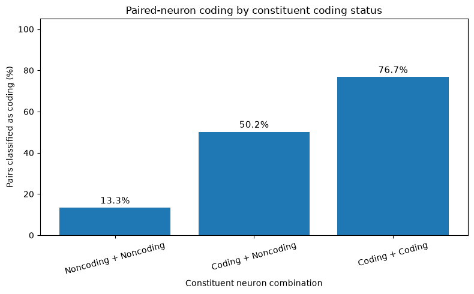
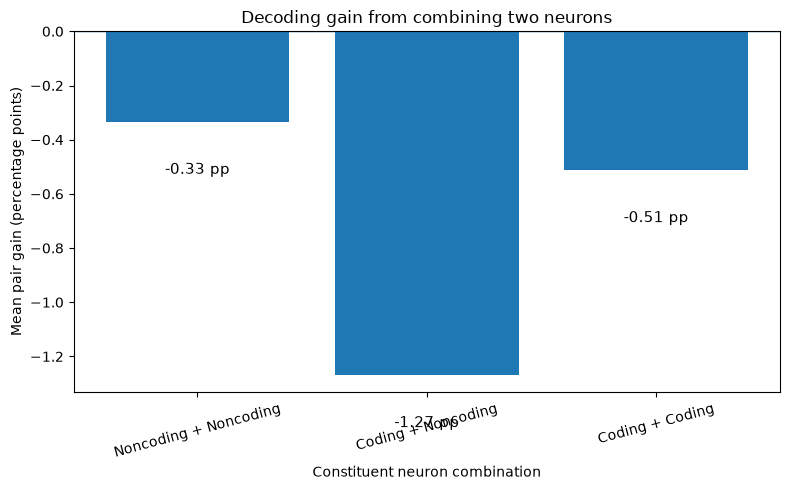
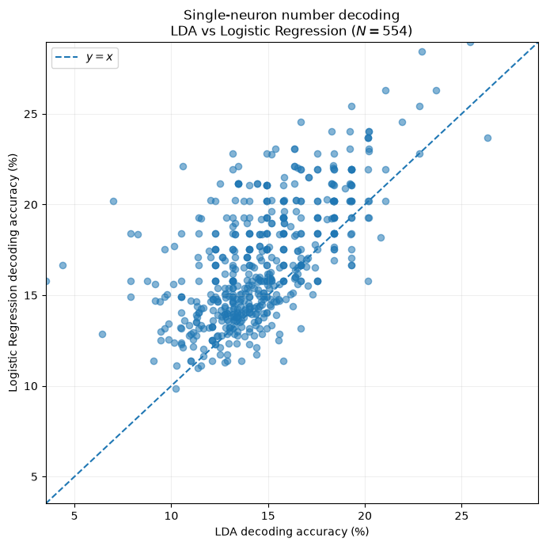

## Paired-Neuron Analysis Across Subjects

### 1. Parallel Computing Setup

- Last week, I had completed the paired-neuron analysis only for a small number of subjects.

- To scale the analysis, I learned how to use the UH research computing environment:
  - connected to the UH server through SSH; (username@login.math.uh.edu)
  - learned how the available compute nodes work; 
  - used separate compute nodes to run different subjects in parallel;
  - used `tmux` sessions so that analyses continued running after disconnecting from SSH.
- This allowed the subject-level analyses to run simultaneously rather than processing all subjects sequentially.

---

### 2. Paired-Neuron Analysis

For each subject:

- Considered all unique pairs of neurons.
- For each pair, performed:
  - firing-rate (FR) decoding;
  - temporal-code (TC) decoding;
  - permutation testing for statistical significance.
- For the temporal decoder, I then compared the pair with its two constituent neurons.

For a pair containing neurons $i$ and $j$, I defined the better individual-neuron accuracy as

$$
A_{\mathrm{best}} = \max(A_i,A_j).
$$

The gain obtained by pairing the neurons was

$$
\Delta A = A_{\mathrm{pair}} - A_{\mathrm{best}}.
$$

Therefore:

- $\Delta A > 0$: pairing improves decoding.
- $\Delta A = 0$: no improvement.
- $\Delta A < 0$: the better individual neuron performs better.

---

### 3. Current Status

- Paired-neuron analyses were launched for all **11 subjects**.
- **10 subjects are currently completed and included in this summary.**
- **YFR is still running**, so it is not included in the results below.
- The 10 completed subjects contain a total of:

$$
\boxed{12,209\text{ neuron pairs}}
$$

| Quantity | Result |
|---|---:|
| Subjects included | 10 |
| Total neuron pairs | 12,209 |
| Mean pair TC accuracy | 15.3% |
| Mean accuracy of better individual neuron | 16.1% |
| Mean pair gain | -0.736 percentage points |
| Median pair gain | -0.629 percentage points |
| Pairs outperforming better individual neuron | 3,320 |
| Percentage of pairs showing improvement | 27.2% |

---

### 4. Does Pairing Improve Decoding?

The main result is that **pairing does not improve decoding accuracy on average**.

Across the 12,209 pairs,

$$
\text{Mean pair accuracy} = 15.3\%
$$

while

$$
\text{Mean better-single-neuron accuracy} = 16.1\%.
$$

Thus,

$$
\boxed{\text{Mean pair gain} = -0.736\text{ percentage points}}
$$

- On average, the paired decoder performs slightly worse than the better constituent neuron.
- However, this is not true for every pair.
- **27.2% of all pairs** outperform their better individual constituent.
- Therefore, there is substantial pair-to-pair variability even though the population-average gain is negative.

> **Main conclusion:** Randomly combining two neurons does not generally improve decoding relative to selecting the better individual neuron.

---

### 5. Does the Result Depend on the Coding Status of the Individual Neurons?

I separated the pairs into three categories based on the temporal-coding significance of their constituent neurons:

1. **Noncoding + Noncoding**
2. **Coding + Noncoding**
3. **Coding + Coding**

| Constituent neurons | Pair classified as coding | Mean gain over better constituent |
|---|---:|---:|
| Noncoding + Noncoding | 13.3% | -0.33 pp |
| Coding + Noncoding | 50.2% | -1.27 pp |
| Coding + Coding | 76.7% | -0.51 pp |

#### Noncoding + Noncoding

- There were **6,062** pairs in which neither constituent neuron was individually classified as temporally coding.
- Of these, **809 pairs** became statistically significant when the two neurons were decoded jointly.

$$
\frac{809}{6062}\times100{=13.35\%}
$$

- Thus, two neurons that individually fail the coding significance criterion can sometimes produce a significant decoder when considered jointly.
- However, their mean decoding gain relative to the better individual neuron is still slightly negative:

$$
\Delta A \approx -0.33\text{ percentage points}.
$$

#### Coding + Noncoding

- When one neuron was individually coding and the other was noncoding, approximately **50.2%** of the resulting pairs were classified as coding.
- This category showed the largest decrease relative to the better constituent:

$$
\Delta A \approx -1.27\text{ percentage points}.
$$

#### Coding + Coding

- When both constituent neurons were individually coding, approximately **76.7%** of the pairs were classified as coding.
- Nevertheless, even these pairs did not improve decoding on average:

$$
\Delta A \approx -0.51\text{ percentage points}.
$$

---

### 6. Interpretation

- **Pairing is not generally better than individual-neuron decoding.**
- The better individual neuron has slightly higher decoding accuracy on average.
- This result is consistent across all three constituent-neuron categories.
- Nevertheless, particular neuron pairs can improve decoding:
  - approximately **27% of all pairs** outperform their better constituent;
  - approximately **13% of noncoding + noncoding pairs** become statistically significant when considered jointly.
- Therefore, the paired-neuron analysis reveals **heterogeneity across neuron pairs** that is not visible from the population-average accuracy alone.

---

> **Across the 10 completed subjects and 12,209 neuron pairs, combining two neurons does not improve temporal decoding on average relative to the better constituent neuron. However, the effect is heterogeneous: about 27% of pairs improve, and about 13% of pairs formed from two individually non-significant neurons become significant when decoded jointly. Thus, pairing is not universally advantageous for decoding accuracy, but some neuron pairs reveal jointly detectable information that is not apparent from individual-neuron significance alone.**

**Remaining:** YFR paired-neuron analysis is still running and can be added once completed.

-----
-----

# LDA vs Logistic Regression — Single-Neuron Number Decoding

## 1

- The original analysis uses **Linear Discriminant Analysis (LDA)**.
- I compared LDA against **multinomial Logistic Regression** using the same single-neuron temporal decoding framework.
- Main questions:
  - Does Logistic Regression improve decoding accuracy relative to LDA?
  - Is the improvement consistent across subjects?
  - Do both methods identify the same neurons as significantly number-coding?
  - How does the permutation-null distribution differ between the two decoders?

---

## 2. Analysis Setup

- Analysis performed at the **single-neuron level**.
- Final dataset contains:

$$
N = 554 \text{ neurons}
$$

from $11$ subjects.

| Region | Number of neurons |
|---|---:|
| HPC | 389 |
| AMY | 77 |
| ENT | 70 |
| para-HPC | 18 |
| **Total** | **554** |

- For each neuron, temporal spike-count features were constructed using different temporal bin sizes.
- For LDA:
  - temporal bin size was optimized;
  - shrinkage parameter $\gamma$ was also optimized.
- For Logistic Regression:
  - temporal bin size was optimized.
- Therefore, the present comparison is:

$$
\text{best LDA configuration}
\quad \text{vs.} \quad
\text{best Logistic configuration}
$$

- This is **not yet a fixed-bin head-to-head comparison**.

---

## 3. Permutation Test

- Statistical significance was evaluated using label permutations.
- Number of permutations:

$$
N_{\mathrm{shuffle}} = 200
$$

- For each decoder, I compared the observed decoding accuracy with the decoder's own shuffled-label null distribution.

- A neuron was classified as **number-coding** when:

$$
p < 0.05
$$

- With $200$ permutations, the smallest attainable permutation $p$-value is approximately:

$$
p_{\min} = \frac{1}{201} \approx 0.00498
$$

- In the current implementation, the optimal hyperparameters are selected using the real labels and then held fixed during the permutation analysis.
- Therefore, this is the **current permutation procedure**, rather than a fully nested procedure in which hyperparameters are re-selected independently inside every permutation.

---

# 4. Overall Decoding Accuracy

## Pooled Single-Neuron Results

| Quantity | LDA | Logistic Regression |
|---|---:|---:|
| Number of neurons | 554 | 554 |
| Mean decoding accuracy | **14.65%** | **16.80%** |

The mean difference in raw decoding accuracy was:

$$
\Delta_{\mathrm{acc}}
=
\mathrm{Accuracy}_{\mathrm{Logistic}}
-
\mathrm{Accuracy}_{\mathrm{LDA}}
$$

$$
\boxed{
\Delta_{\mathrm{acc}} = +2.15 \text{ percentage points}
}
$$

The median neuron-level difference was:

$$
\boxed{
\mathrm{Median}(\Delta_{\mathrm{acc}})
=
+1.75 \text{ percentage points}
}
$$

---

## 5. Neuron-by-Neuron Accuracy Comparison

| Comparison | Number of neurons | Percentage |
|---|---:|---:|
| Logistic $>$ LDA | **424** | **76.53%** |
| LDA $>$ Logistic | **88** | **15.88%** |
| Logistic $=$ LDA | **42** | **7.58%** |
| **Total** | **554** | **100%** |

- Logistic Regression gives higher raw decoding accuracy for approximately three-quarters of the neurons:

$$
\frac{424}{554}
=
76.53\%
$$

- Therefore, the higher Logistic accuracy is not coming only from a small number of outlier neurons.

---

## 6. Overall Accuracy Scatter Plot

- I plotted, for every neuron,

$$
x = \mathrm{LDA\ accuracy}
$$

against

$$
y = \mathrm{Logistic\ accuracy}.
$$

- The reference line is:

$$
y=x.
$$

Interpretation:

- points above $y=x$ $\rightarrow$ Logistic Regression performs better;
- points below $y=x$ $\rightarrow$ LDA performs better;
- points on $y=x$ $\rightarrow$ equal decoding accuracy.

### Figure

<!-- Insert overall LDA vs Logistic scatter plot here -->

The majority of neurons lie above the $y=x$ reference line, consistent with the numerical result that $76.53\%$ of neurons have higher Logistic accuracy.

---

# 7. Subject-Level Comparison

I next checked whether the Logistic advantage was driven by only a few subjects.

| Subject | $N$ | LDA Mean (%) | Logistic Mean (%) | $\Delta$ Logistic $-$ LDA (pp) | Logistic Better | LDA Better | Tie | Logistic Better (%) |
|---|---:|---:|---:|---:|---:|---:|---:|---:|
| YFF | 37 | 15.27 | 17.80 | **+2.53** | 26 | 7 | 4 | 70.27 |
| YFI | 29 | 16.35 | 21.72 | **+5.37** | 29 | 0 | 0 | 100.00 |
| YFJ | 45 | 15.67 | 18.87 | **+3.20** | 37 | 6 | 2 | 82.22 |
| YFK | 44 | 15.93 | 19.00 | **+3.07** | 36 | 3 | 5 | 81.82 |
| YFL | 57 | 15.11 | 17.90 | **+2.79** | 46 | 4 | 7 | 80.70 |
| YFM | 61 | 15.65 | 17.82 | **+2.17** | 42 | 9 | 10 | 68.85 |
| YFP | 43 | 14.66 | 18.71 | **+4.05** | 43 | 0 | 0 | 100.00 |
| YFR | 65 | 13.55 | 15.08 | **+1.53** | 50 | 11 | 4 | 76.92 |
| YFS | 59 | 13.83 | 13.82 | **-0.01** | 30 | 24 | 5 | 50.85 |
| YFT | 52 | 13.28 | 14.07 | **+0.78** | 38 | 11 | 3 | 73.08 |
| YFU | 62 | 13.50 | 14.43 | **+0.93** | 47 | 13 | 2 | 75.81 |

### Main observation

- Logistic Regression has higher mean accuracy in:

$$
\boxed{10/11 \text{ subjects}}
$$

- YFS is the only exception:

$$
\Delta_{\mathrm{YFS}}
=
13.82-13.83
=
-0.01\text{ pp},
$$

which is essentially no difference.

- Largest subject-level improvements:

| Subject | Logistic $-$ LDA |
|---|---:|
| YFI | **+5.37 pp** |
| YFP | **+4.05 pp** |
| YFJ | **+3.20 pp** |
| YFK | **+3.07 pp** |
| YFL | **+2.79 pp** |

- Particularly striking:
  - YFI: Logistic better for $29/29$ neurons.
  - YFP: Logistic better for $43/43$ neurons.

---

## 8. Subject-Level Scatter Plots

- I also plotted separate LDA-vs-Logistic scatter plots for all $11$ subjects.
- Every subplot uses the same $x$- and $y$-axis limits.
- Each subplot contains the same $y=x$ reference line.

### Figure

<!-- Insert 11-subject scatter plot figure here -->

- Most subjects show a clear displacement of neurons above $y=x$.
- YFS is noticeably more balanced around the identity line, consistent with:

$$
\Delta_{\mathrm{YFS}}\approx0.
$$

---

# 9. Number-Coding Neurons

The next question was whether higher decoding accuracy also means that Logistic Regression identifies more statistically significant number-coding neurons.

It does **not**.

| Decoder | Significant coding neurons | Total | Percentage |
|---|---:|---:|---:|
| LDA | **156** | 554 | **28.16%** |
| Logistic Regression | **129** | 554 | **23.29%** |

Therefore,

$$
\boxed{
N_{\mathrm{coding}}^{\mathrm{LDA}}
>
N_{\mathrm{coding}}^{\mathrm{Logistic}}
}
$$

even though

$$
\boxed{
\mathrm{Accuracy}_{\mathrm{Logistic}}
>
\mathrm{Accuracy}_{\mathrm{LDA}}.
}
$$

This was initially a surprising result.

---

# 10. Agreement Between the Two Decoders

I then checked whether LDA and Logistic Regression identify the same neurons as number-coding.

| Classification | Number of neurons | Percentage |
|---|---:|---:|
| Coding in both | **87** | **15.70%** |
| LDA only | **69** | **12.45%** |
| Logistic only | **42** | **7.58%** |
| Neither | **356** | **64.26%** |
| **Total** | **554** | **100%** |

The total number of neurons classified as coding by at least one decoder is:

$$
87+69+42=198.
$$

Among these $198$ neurons, the fraction detected by both methods is:

$$
\frac{87}{198}
\approx
43.94\%.
$$

So only about:

$$
\boxed{44\%}
$$

of the neurons identified as coding by at least one method are shared between the two decoders.

### Important observation

- The choice of decoder changes not only the decoding accuracy.
- It can also change **which individual neurons are classified as number-coding**.
- There are:
  - $69$ LDA-only coding neurons;
  - $42$ Logistic-only coding neurons.

---

# 11. Why Does Logistic Have Higher Accuracy but Fewer Coding Neurons?

This became the most interesting comparison.

## Observed Accuracy vs Permutation Null

| Quantity | LDA | Logistic Regression |
|---|---:|---:|
| Observed mean accuracy | **14.65%** | **16.80%** |
| Mean permutation-null accuracy | **11.02%** | **13.60%** |
| Observed $-$ null mean | **3.63 pp** | **3.20 pp** |
| Median observed $-$ null | **3.39 pp** | **2.75 pp** |

Although Logistic has higher absolute accuracy,

$$
16.80\% > 14.65\%,
$$

its permutation-null baseline is also substantially higher:

$$
13.60\% > 11.02\%.
$$

Therefore, relative to each decoder's own null distribution:

$$
14.65-11.02
=
\boxed{3.63\text{ pp}}
\qquad \text{for LDA},
$$

whereas

$$
16.80-13.60
=
\boxed{3.20\text{ pp}}
\qquad \text{for Logistic}.
$$

The same effect is visible in the medians:

$$
3.39\text{ pp}
>
2.75\text{ pp}.
$$

### Interpretation

- Logistic Regression has a higher **absolute decoding accuracy**.
- But Logistic also has a higher **chance/permutation decoding baseline**.
- LDA has a slightly larger average separation between observed performance and its own null distribution.
- This helps explain why LDA produces more neurons satisfying:

$$
p<0.05.
$$

- However, the quantity

$$
\mathrm{Accuracy}_{\mathrm{observed}}
-
\mathrm{mean}(\mathrm{Accuracy}_{\mathrm{null}})
$$

is only a descriptive measure.
- Statistical significance is determined using the **full permutation distribution**, not only the null mean.

---

# 12. Number-Coding Comparison Figure

I also compared the percentage of significant number-coding neurons for LDA and Logistic Regression across subjects.

### Figure

<!-- Insert subject-level number-coding bar plot here -->

The final pooled values are:

| Decoder | Coding | Non-coding | Coding Percentage |
|---|---:|---:|---:|
| LDA | **156** | 398 | **28.16%** |
| Logistic Regression | **129** | 425 | **23.29%** |

---

# 13. Current Interpretation

- **Raw decoding performance**
  - Logistic Regression performs better.
  - Mean improvement:

$$
\boxed{+2.15\text{ pp}}
$$

  - Logistic is better for:

$$
\boxed{424/554=76.53\%}
$$

of neurons.

- **Subject-level consistency**
  - Logistic has higher mean accuracy in:

$$
\boxed{10/11}
$$

subjects.

- **Statistically significant number coding**
  - LDA detects more coding neurons:

$$
\boxed{
156\;(28.16\%)
\quad\text{vs.}\quad
129\;(23.29\%)
}
$$

- **Decoder agreement**
  - Only $87$ neurons are significant under both methods.
  - $69$ are LDA-only.
  - $42$ are Logistic-only.
  - Therefore, decoder choice affects the identity of neurons classified as coding.

- **Permutation baseline**
  - Logistic has higher raw accuracy, but also a higher permutation-null baseline.
  - Mean excess over null:

$$
\boxed{
3.63\text{ pp (LDA)}
>
3.20\text{ pp (Logistic)}
}
$$

---

# 14. Important Caveats / Next Questions

- This comparison is currently **optimized decoder vs. optimized decoder**.

$$
\text{LDA: best bin + best }\gamma
$$

$$
\text{Logistic: best bin}
$$

- Therefore, this does not yet answer whether Logistic is better when both decoders receive exactly the same temporal representation.

- Hyperparameters are selected from the real-label analysis and then fixed for the permutation analysis.
- A stricter control would re-select the hyperparameters inside every shuffle.

- The $554$ neurons should not automatically be treated as $554$ independent biological replicates because neurons are nested within $11$ subjects.

$$
\text{neurons} \subset \text{subjects}
$$

- Therefore, subject-level or hierarchical inference would be more appropriate for a formal statistical comparison.

- The pooled $554$-neuron analysis here is a **pooled single-neuron analysis**, not a multineuron population decoder.

---

# Final Conclusion

> [!IMPORTANT]
> **LDA vs Logistic Regression**
>
> Across $554$ MTL neurons from $11$ subjects, Logistic Regression produced higher absolute single-neuron number-decoding accuracy than LDA:
>
> $$
> \boxed{
> 16.80\%\;(\mathrm{Logistic})
> >
> 14.65\%\;(\mathrm{LDA})
> }
> $$
>
> Logistic Regression outperformed LDA for $424/554=76.53\%$ of neurons and had higher mean accuracy in $10/11$ subjects.
>
> However, LDA identified more statistically significant number-coding neurons:
>
> $$
> \boxed{
> 156\;(28.16\%)\;\mathrm{LDA}
> >
> 129\;(23.29\%)\;\mathrm{Logistic}
> }
> $$
>
> This difference appears to be related, at least in part, to the different permutation baselines:
>
> $$
> \boxed{
> \mathrm{Observed}-\mathrm{Null}
> =
> 3.63\text{ pp (LDA)}
> >
> 3.20\text{ pp (Logistic)}
> }
> $$
>
> **Current conclusion:** Logistic Regression gives better **absolute decoding accuracy**, whereas LDA gives slightly stronger **separation from its own permutation-null baseline** and identifies more significant number-coding neurons. Therefore, the two decoders are not interchangeable: decoder choice affects both decoding performance and which neurons are identified as carrying significant number information.